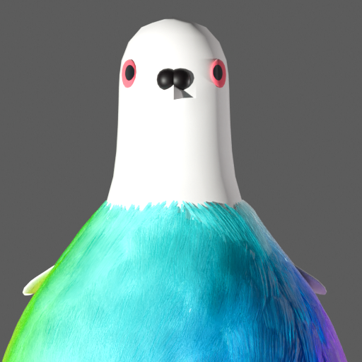
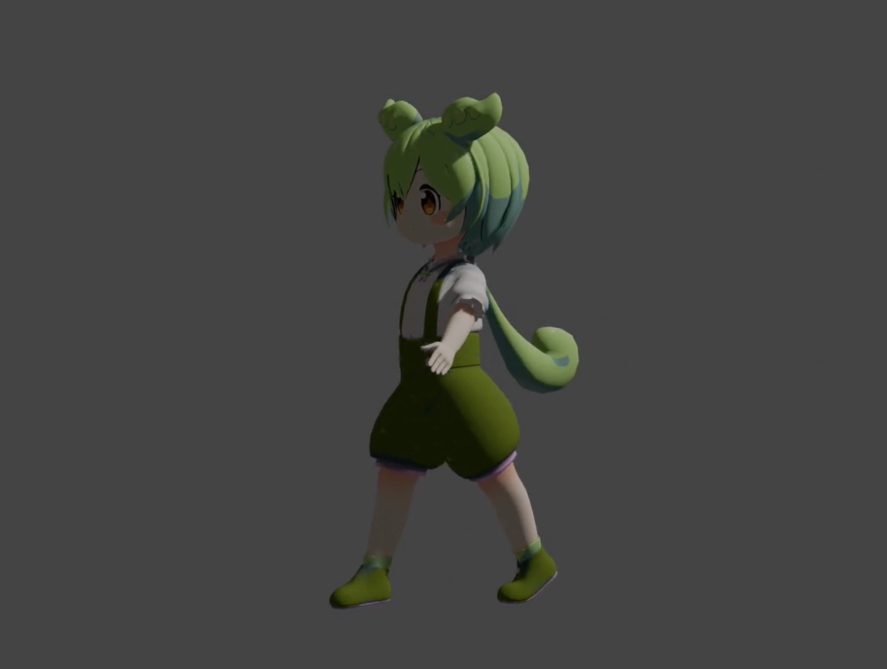
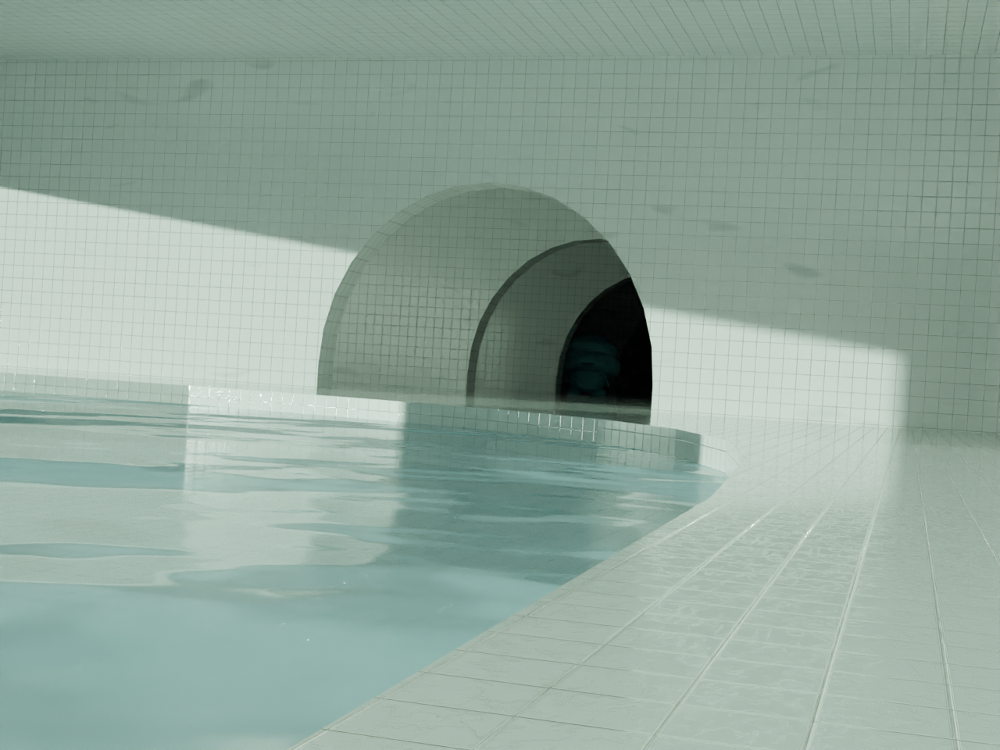

# 自己紹介

::left::

    
    <h2 >はっと</h2>

::right::

    

        <h3 class="">情報工学 4回</h3>
        <h5 class="">そふらぼ所属</h5>
        <h4>好きなこと：ボードゲーム</h4>
        

        <h3><fa6-brands-x-twitter/> @pipipihatto</h3>
        <h3><fa6-brands-github/> @ry05k2ulv</h3>
    

    

        <h4>Bldenderを少し触りました</h4>
        

            
            
        

    

