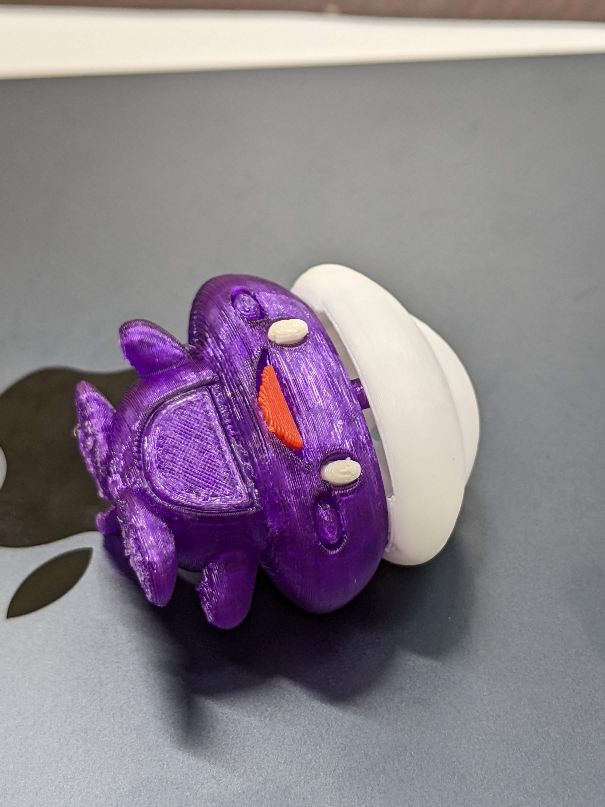
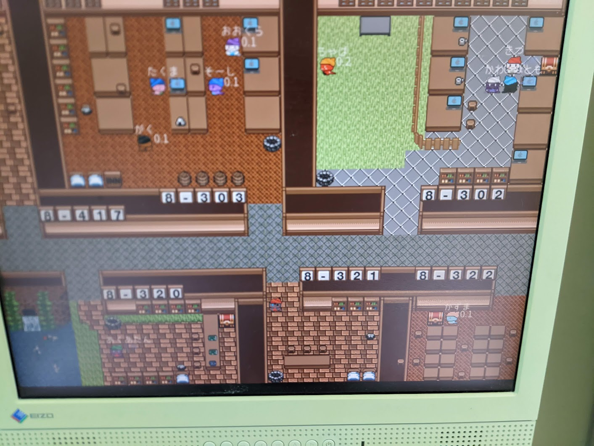
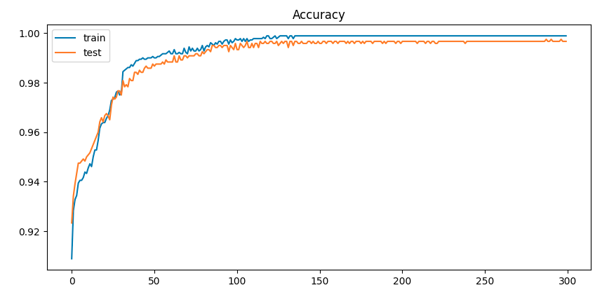
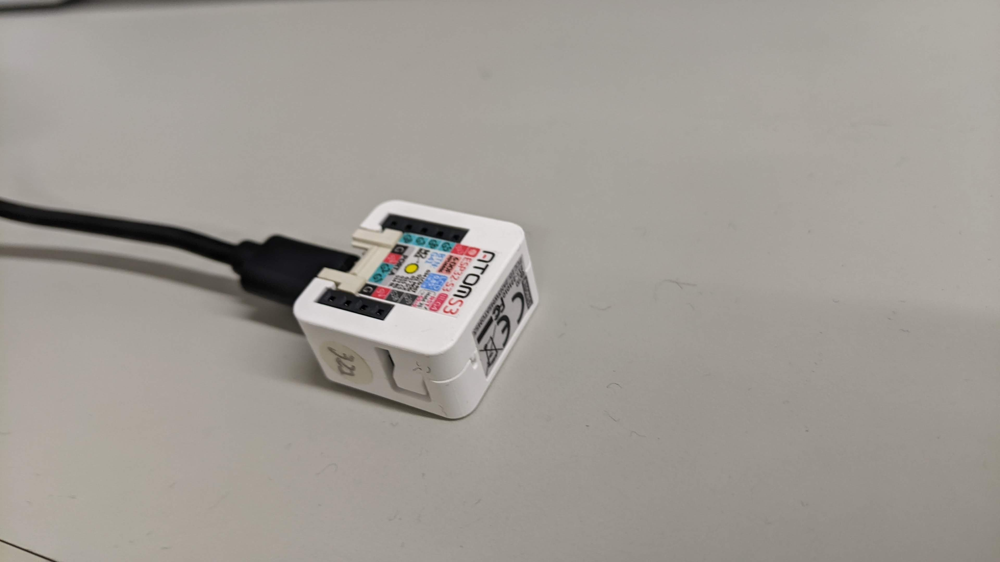
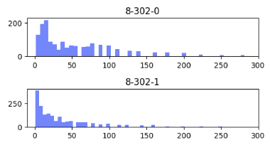
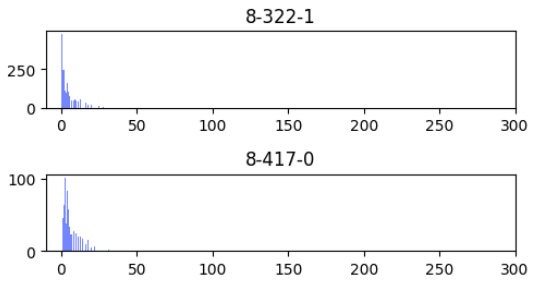
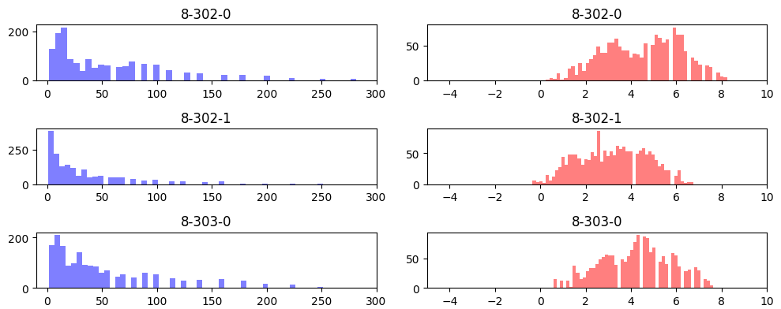
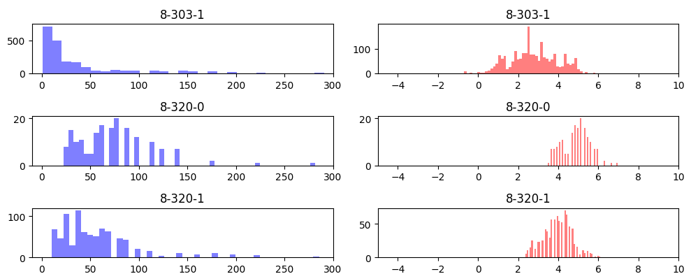
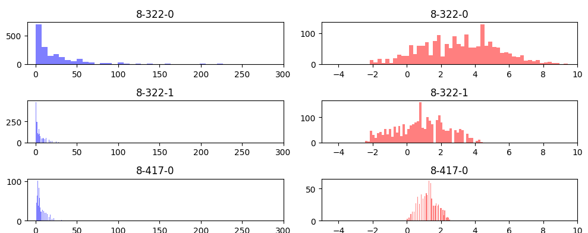

# 研究室の在室モニターシステムに<br/>機械学習を導入した話


---
src: ./pages/bio.md
hide: false
---
---

<style>
    ul li {
        font-size: 1.2rem;
    }
</style>

# 始めに

- そふらぼでは，BLEビーコンを使って在室状況をモニターしています．
- 8303のドア付近に在室者を表示するディスプレイを設置されています．
 
<div class="grid grid-cols-3 grid-flow-col gap-4">
    <figure class="relative w-full h-50">
        
        <figcaption class="absolute top-0 bg-gray-400 bg-opacity-60 w-full text-center rounded-t-lg">BLEビーコン</figcaption>
    </figure>
    <figure class="relative w-full h-50">
        
        <figcaption class="absolute top-0 bg-gray-400 bg-opacity-60 w-full text-center rounded-t-lg">検知器</figcaption>
    </figure>
    <figure class="relative w-full h-50">
        
        <figcaption class="absolute top-0 bg-gray-400 bg-opacity-60 w-full text-center rounded-t-lg">RPG風ディスプレイ</figcaption>
    </figure>
</div>

---

# 始めに

- 各検知器が拾った電波強度から，どの部屋にいるかを推定しています．

<div class="flex items-center">
    
    
<v-click>
$$
\rightarrow
\begin{bmatrix}
300.00 \\ null \\ 24.61 \\ 9.72 \\ 73.84
\end{bmatrix}
$$
</v-click>
</div>

- 今までは，<span v-mark.circle.red="3">SQLクエリのみ</span>の簡単なルールで推定していました．

<style>
    .slidev-vclick-hidden {
        display: none;
    }
</style> 

---
layout: image-right
image: ./images/rooms-next.svg
backgroundSize: 90%
---

# 問題

- 新たに学生部屋が増えたため，ルールの変更が必要
- 従来のSQLクエリのみの方法では，ルールの記述が困難

<v-click>
<h1 class="text-red-600 my-10 mx-4 ">機械学習を使おう！</h1>
</v-click>

---
layout: section
---

## 試作してみよう

#### 8302と8303の分類

---

# NeuralNetworkを試してみる


- Pytorchでのモデル定義

```python{*|4-11}  
class AquaBleClassifier(nn.Module):
    def __init__(self):
        super(AquaBleClassifier, self).__init__()
        self.fc_layers = nn.Sequential(
            nn.Linear(INPUT_DIM, HIDDEN_DIM),
            nn.ReLU(),
            nn.Linear(HIDDEN_DIM, HIDDEN_DIM),
            nn.SiLU(),
            nn.Linear(HIDDEN_DIM, OUTPUT_DIM),
            nn.Softmax(dim=1)
        )

    def forward(self, x):
        x = self.fc_layers(x)
        return x
```
<v-after>

- レイヤーを追加していくだけで，簡単にモデルを定義できる

</v-after>

---

# 結果（試作）


|  |  |
| --- | --- |
| Train accuracy | 0.9988889 |
| Test accuracy  | 0.9966667 |




---  
layout: section
---

## 全部屋でやってみよう

---


<div class="flex items-center space-x-6">
    
    <h2 class="ballon bg-zinc-200 dark:bg-zinc-800">新しい検知器持ってきた！</h2>
</div>

- omznが新しい部屋用に検知器を持ってきてくれた
- どうやら受信する感度が違うらしい
- NeuralNetworkなら，勝手に学習してくれるはず 🧐

<div class="grid grid-cols-2">
    <figure class="relative w-80">
        
        <figcaption class="absolute top-0 bg-gray-400 bg-opacity-60 w-full text-center rounded-t-lg">新しい検知器</figcaption>
    </figure>
    <figure class="relative w-80">
        
        <figcaption class="absolute top-0 bg-gray-400 bg-opacity-60 w-full text-center rounded-t-lg">前からある検知器</figcaption>
    </figure>
</div>

<style>
.ballon {
    clip-path: polygon(20px 0, 100% 0, 100% 100%, 0 100%, 20px calc(100% - 20px), 20px 0);
    padding: 1rem;
    padding-left: 2.5rem;
}

ul {
    padding-top: 1rem;
    padding-bottom: 1rem;
}
</style>

---
layout: image-right
image: ./images/v1_acc.png
backgroundSize: 70%
---

# 結果

|   |   |
| --- | --- |
| Train Accuracy | 0.664000 |
| Test Accuracy  | 0.659333 |

- 収束しない．．．

<style>
ul {
    padding-top: 1rem;
    padding-bottom: 1rem;
}
</style>

---

# なぜ？

- 検知器によって電波強度の<span v-mark.circle.red>スケールが異なる</span>
- 電波強度は距離の2乗に反比例するため，<span v-mark.circle.red>分布が偏る</span> 
- 実際に．．．

<div class="grid grid-cols-2 divide-">
    
    
    
    
</div>


---

# どうする？

<v-click>

### Box-Cox変換を使おう


$$
BoxCox(x) = \begin{cases}
    \frac{x^\lambda - 1}{\lambda} & \text{if } \lambda \neq 0 \\
    \log(x) & \text{if } \lambda = 0
\end{cases}
$$

</v-click>

<v-click>

### Box-Cox変換の目的
- 正規分布に近づける
- スケールを揃える
- 外れ値の影響を抑える

</v-click>

<style>
ul {
    padding-top: 1rem;
    padding-bottom: 1rem;
}
</style>

---

# どうやって $\lambda$ を求める？

#### Pythonにはscipy.stats.boxcoxがある

```python{4}

df = pd.concat([pd.read_csv(f"{DIRECTORY}/{f}") for f in FILES])
for (place, detector), df in df.groupby(["place", "detector"]):
    original_proxi = df["proxi"]
    transformed_proxi, lambda_value = stats.boxcox(original_proxi)
    detectors.append(f"{place}-{detector}")
    original_proxies.append(original_proxi)
    transformed_proxies.append(transformed_proxi)
    lambda_values.append(lambda_value)
```

---

# Box-Cox変換後の分布

<div class="grid grid-cols-2">
    
    
    
</div>

---
layout: image-right
image: ./images/v1_acc_boxcox.png
backgroundSize: 70%
---

# 結果

|   |   |
| --- | --- |
| Train Accuracy | 0.999750 |
| Test Accuracy  | 0.998667 |

<v-click>

<h1 class="text-red-500 my-10 mx-4 ">収束した！</h1>

</v-click>

<style>
ul {
    padding-top: 1rem;
    padding-bottom: 1rem;
}
</style>

<!-- ---

# まとめ

- 機械学習を導入することで，手作業でのルール変更が不要になった
- 電波強度のスケールの違いをBox-Cox変換で解消することで，精度が向上した -->

---
layout: end
---
## 終わり